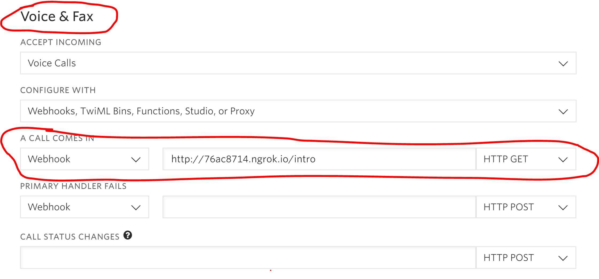

# I Need Help

## About

I Need Help is a web app that helps connect people that can't communicate with social media or texting a way to get help if they need it. In particular, elderly people or others who only have landlines or voice-only phones.

## Setup

### Requirements

- [Node](https://nodejs.org/en/) (8.0 or greater)
- [Yarn](https://yarnpkg.com/)
- A Twilio account — [Sign up](https://www.twilio.com/try-twilio)

Here are the Twilio values you'll need:

| Config&nbsp;Value | Description                                                                                                                                                  |
| :---------------- | :----------------------------------------------------------------------------------------------------------------------------------------------------------- |
| Account&nbsp;Sid  | Your primary Twilio account identifier - find this [in the Console](https://www.twilio.com/console).                                                         |
| Auth&nbsp;Token   | Used to authenticate - [just like the above, you'll find this here](https://www.twilio.com/console).                                                         |
| Two Phone&nbsp;numbers | Two Twilio phone numbers in [E.164 format](https://en.wikipedia.org/wiki/E.164) - you can [get them here](https://www.twilio.com/console/phone-numbers/incoming) |
| Proxy service | [Create a new proxy service](https://www.twilio.com/console/proxy) and take note of the SID

After you've created the proxy service, take one of those phone numbers and [add one of your newly-purchased phone numbers to it](https://www.twilio.com/docs/proxy/quickstart?code-sample=code-add-a-phone-number).

### Local development

#### Clone this repo
```bash
git clone https://github.com/jcs224/ineedhelp.git
cd ineedhelp
```

#### Install dependencies
```
yarn install
```

#### Set up `.env` file

Copy the `.env.example` to a new `.env` file:
```bash
cp .env.example .env
```

Then, edit the following values in the `.env` file:
- `TWILIO_ACCOUNT_SID`: Your Twilio project's SID
- `TWILIO_AUTH_TOKEN`: Your Twilio project's auth token
- `TWILIO_PROXY_SERVICE_SID`: The proxy service SID
- `NUMBER_TO_CALL_ACTUAL`: The `E.164` representation of the phone number **not** used for the proxy service
- `NUMBER_TO_CALL_DISPLAY`: A human-friendly representation of **NUMBER_TO_CALL_ACTUAL**. This will be what is displayed on the site for people to call.

#### Set up database

You can use MySQL, POSTGRES, MariaDB, MSSQL, or SQLite (Anything [Adonis](https://adonisjs.com/docs/4.1/database#_supported_databases) supports). SQLite is the quickest setup, so we'll use that in these docs. Create a `.sqlite` in the `database` folder of the project.
```bash
cd database
touch ineedhelp.sqlite
cd ..
```

Then, we'll need to run database migrations:
```
npx adonis migration:run
```

#### Run the application
Run this command to start the app up:
````
npx adonis serve --dev
````

By default, in your browser you should be able to visit `http://localhost:3333` and see the homepage!

Once you've done that, click the *Sign Up to Help* button in the top-left corner (or from the dropdown menu on mobile) and create an account.

#### Set up an ngrok proxy to start adding calls

Leave the current app running and open a second terminal tab or window, then run this command:
```bash
npx ngrok http 3333
```

Then, using your call number (`NUMBER_TO_CALL_ACTUAL`), follow [this great tutorial](https://www.youtube.com/watch?v=S1uExj7mMgM) on forwarding your local development environment so you can start making phone calls and leaving requests for help.

Using the video as reference, we already did the step with ngrok. 

- In the webhook field in the app, instead of under the *Messanging* section, under *Voice & Fax*, Copy and paste the ngrok url produced from the `npx ngrok http 3333` command in the "A call comes in" section
- Change the `/sms` at the end to `/intro`. 
- Change the `HTTP POST` dropdown to `HTTP GET`. It should look like this screenshot, but with a slightly different `ngrok` code:



### Usage

Call the phone number on the homepage of the site (Should be your `NUMBER_TO_CALL_DISPLAY` in your `.env` file), follow the prompts, and you should see your call pop up on the page automatically, no refresh required!
